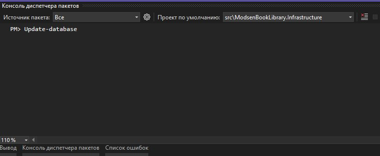
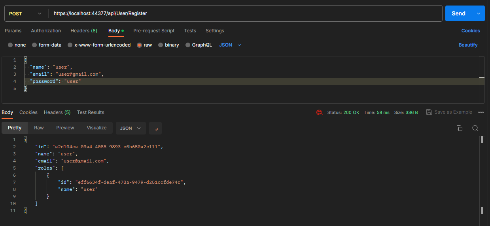
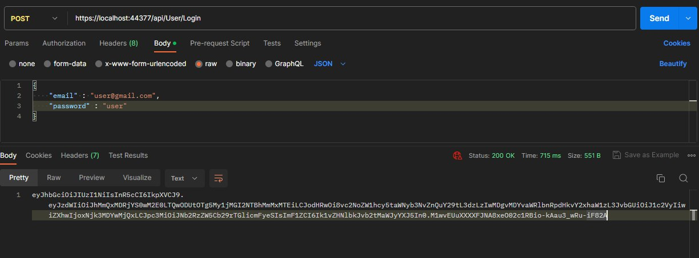
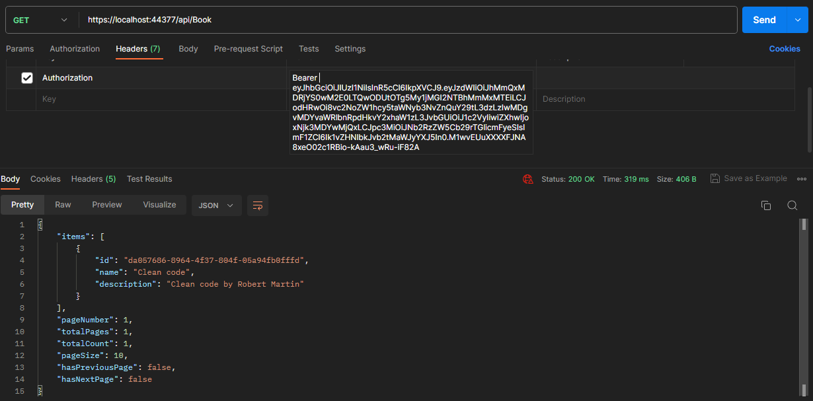

# ModsenBookLibrary

<h2>Инструкция по запуску приложения</h2>

<ol>
  <li>Для работы приложения необходимо установить MS SQL Server и Visual Studio.</li>
  <li>Скачайте проект и откройте его в Visual Studio. <b>Важно:</b> для запуска проекта необходимо иметь .NET 7 или выше.</li>
  <li>Откройте <b>Консоль диспетчера пакетов</b>, выберите проект <b>ModsenBookLibrary.Infrastructure</b> и напишите команду <i>Update-Database</i>. В случае успешного выполнения, будет создана база данных приложения.</li>
  <li>После создания базы данных, необходимо зарегистрировать первого пользователя. Для демонстрации работы будет использован <b>Postman</b>. Необходимо послать Post запрос как на скриншоте ниже. </li>
  <li>После успешной регистрации пользователя (статус код 200) необходимо получить его JWT токен. Для этого необходимо войти в приложение. Пример успешного входа в приложение показан на скриншоте ниже. </li>
  <li>После получения токена пользователя становятся доступными функции приложения, но для их работы необходимо в заголовок запроса <b>Authorization</b> вставить значение: '<b><i>Bearer <ваш_токен_пользователя></i></b>'. Пример успешного запроса к API показан на скриншоте ниже. </li>
  <li>В случае неудачи, писать мне :)</li>
</ol>

